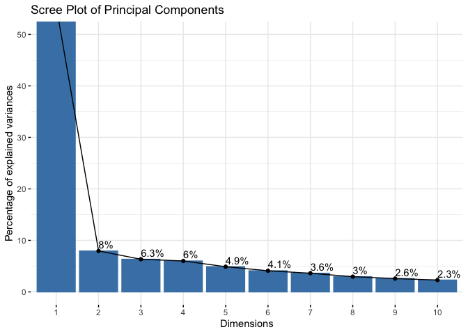

Age Prediction Using Multi-Omic Data
================
Dr. R. Craig Stillwell

## Introduction

This report analyzes gene expression data to uncover patterns,
relationships, and predictive insights. The analysis covers data
preparation, correlation analysis, dimensionality reduction (PCA),
clustering, and predictive modeling using machine learning techniques
like Random Forest.

## Data Preparation

We start by loading the dataset and checking for missing values,
ensuring data quality before analysis.

``` r
# Load the dataset (adjust the filename if necessary)
data <- fread("data/test_rows.csv")

# Preview the data
head(data)
```

    ##    RPA2_3 ZYG11A_4  F5_2 HOXC4_1 NKIRAS2_2 MEIS1_1 SAMD10_2 GRM2_9 TRIM59_5
    ##     <num>    <num> <num>   <num>     <num>   <num>    <num>  <num>    <num>
    ## 1:  65.96    18.08 41.57   55.46     30.69   63.42    40.86  68.88    44.32
    ## 2:  66.83    20.27 40.55   49.67     29.53   30.47    37.73  53.30    50.09
    ## 3:  50.30    11.74 40.17   33.85     23.39   58.83    38.84  35.08    35.90
    ## 4:  65.54    15.56 33.56   36.79     20.23   56.39    41.75  50.37    41.46
    ## 5:  59.01    14.38 41.95   30.30     24.99   54.40    37.38  30.35    31.28
    ## 6:  81.30    14.68 35.91   50.20     26.57   32.37    32.30  55.19    42.21
    ##    LDB2_3 ELOVL2_6 DDO_1 KLF14_2
    ##     <num>    <num> <num>   <num>
    ## 1:  56.17    62.29 40.99    2.30
    ## 2:  58.40    61.10 49.73    1.07
    ## 3:  58.81    50.38 63.03    0.95
    ## 4:  58.05    50.58 62.13    1.99
    ## 5:  65.80    48.74 41.88    0.90
    ## 6:  70.15    61.36 33.62    1.87

``` r
# Check the structure of the dataset
str(data)
```

    ## Classes 'data.table' and 'data.frame':   104 obs. of  13 variables:
    ##  $ RPA2_3   : num  66 66.8 50.3 65.5 59 ...
    ##  $ ZYG11A_4 : num  18.1 20.3 11.7 15.6 14.4 ...
    ##  $ F5_2     : num  41.6 40.5 40.2 33.6 42 ...
    ##  $ HOXC4_1  : num  55.5 49.7 33.9 36.8 30.3 ...
    ##  $ NKIRAS2_2: num  30.7 29.5 23.4 20.2 25 ...
    ##  $ MEIS1_1  : num  63.4 30.5 58.8 56.4 54.4 ...
    ##  $ SAMD10_2 : num  40.9 37.7 38.8 41.8 37.4 ...
    ##  $ GRM2_9   : num  68.9 53.3 35.1 50.4 30.4 ...
    ##  $ TRIM59_5 : num  44.3 50.1 35.9 41.5 31.3 ...
    ##  $ LDB2_3   : num  56.2 58.4 58.8 58 65.8 ...
    ##  $ ELOVL2_6 : num  62.3 61.1 50.4 50.6 48.7 ...
    ##  $ DDO_1    : num  41 49.7 63 62.1 41.9 ...
    ##  $ KLF14_2  : num  2.3 1.07 0.95 1.99 0.9 1.87 1.25 4.18 4.73 3.43 ...
    ##  - attr(*, ".internal.selfref")=<externalptr>

``` r
# Check for missing values
missing_values <- sapply(data, function(x) sum(is.na(x)))
missing_values[missing_values > 0]
```

    ## named integer(0)

## Correlation Analysis

We compute and visualize the correlation matrix to understand
relationships between genes.

``` r
# Compute the correlation matrix
correlation_matrix <- cor(data, use = "complete.obs")

# Adjust margins to give more space for the title and labels
par(mar = c(5, 5, 4.7, 5)) # Bottom, left, top, right margins

# Visualize the correlation matrix
corrplot(correlation_matrix, method = "color", tl.col = "black", tl.cex = 0.7)

# Add a properly spaced title
title(main = "Gene Expression Correlation Matrix", line = 4, cex.main = 1.5)
```

<!-- -->

## Distribution Analysis

Analyzing the distribution of gene expression levels helps identify
skewness or outliers in the data.

``` r
# Plot distributions of RPA2_3 expression
ggplot(data, aes(x = RPA2_3)) +
  geom_histogram(binwidth = 0.5, fill = "blue", alpha = 0.7) +
  theme_minimal() +
  labs(title = "Distribution of RPA2_3 Expression", x = "RPA2_3 Expression Level", y = "Frequency")
```

<!-- -->

## Principal Component Analysis (PCA)

PCA reduces dimensionality and highlights the main components
contributing to variation in gene expression.

``` r
# Perform PCA on the dataset
pca_result <- prcomp(data, scale. = TRUE)

# Visualize explained variance
fviz_eig(pca_result, addlabels = TRUE, ylim = c(0, 50), main = "Scree Plot of Principal Components")
```

<!-- -->

``` r
# Plot the PCA biplot
fviz_pca_biplot(pca_result, repel = TRUE, col.var = "contrib", 
                gradient.cols = c("#00AFBB", "#E7B800", "#FC4E07"),
                title = "PCA Biplot of Gene Expression Data")
```

<!-- -->

## Clustering Analysis

Clustering helps group similar samples based on gene expression
patterns.

``` r
# Elbow method to determine optimal clusters
set.seed(123)
wss <- sapply(1:10, function(k) kmeans(data, centers = k, nstart = 20, iter.max = 300)$tot.withinss)

# Plot Elbow curve
plot(1:10, wss, type = "b", pch = 19, frame = FALSE,
     xlab = "Number of clusters K", ylab = "Total within-clusters sum of squares",
     main = "Elbow Method for Determining Optimal K")
```

<!-- -->

``` r
# Apply K-means clustering with K=3
kmeans_result <- kmeans(data, centers = 3, nstart = 20)

# Add cluster labels to data
data$cluster <- as.factor(kmeans_result$cluster)

# Visualize clusters
ggplot(data, aes(x = RPA2_3, y = ZYG11A_4, color = cluster)) +
  geom_point(alpha = 0.7) +
  theme_minimal() +
  labs(title = "K-Means Clustering of Gene Expression Data", x = "RPA2_3 Expression", y = "ZYG11A_4 Expression")
```

<!-- -->

## Predictive Modeling

Random Forest is a powerful machine learning technique that can handle
high-dimensional data and capture complex relationships. Here, we use it
to predict individual age based on gene expression data.

``` r
# Create a Synthetic 'Age' Column for testing
data$Age <- sample(20:80, nrow(data), replace = TRUE)  # Random age values between 20 and 80
# Train-test split (80/20 split)
set.seed(42)
train_idx <- sample(seq_len(nrow(data)), size = 0.8 * nrow(data))
train_data <- data[train_idx, ]
test_data <- data[-train_idx, ]

# Train Random Forest model
rf_model <- randomForest(Age ~ ., data = train_data, proximity = TRUE, importance = TRUE, ntree = 500)

# Predict on test set
predictions <- predict(rf_model, newdata = test_data)

# Evaluate model performance
actual <- test_data$Age
mse <- mean((predictions - actual)^2)
cat("Mean Squared Error (MSE):", mse)
```

    ## Mean Squared Error (MSE): 347.9118

``` r
# Visualize feature importance
varImpPlot(rf_model, main = "Feature Importance - Gene Expression Data")
```

<!-- -->

## Heatmap of Gene Correlations

Heatmaps provide a visual summary of correlations among genes,
highlighting clusters and patterns.

``` r
# Remove cluster column for correlation analysis
data_numeric <- data[, !("cluster"), with = FALSE]

# Compute the correlation matrix
gene_correlation <- cor(data_numeric, use = "complete.obs")

# Create heatmap
pheatmap(gene_correlation, color = colorRampPalette(c("navy", "white", "firebrick3"))(50),
         main = "Heatmap of Gene Expression Correlations", display_numbers = TRUE)
```

<!-- -->

## Conclusion

This analysis provides insights into gene expression patterns,
clustering, and feature importance. By leveraging machine learning
techniques such as PCA and Random Forest, we can identify key features
and underlying structures in the data, aiding future biological
interpretations and research directions.
